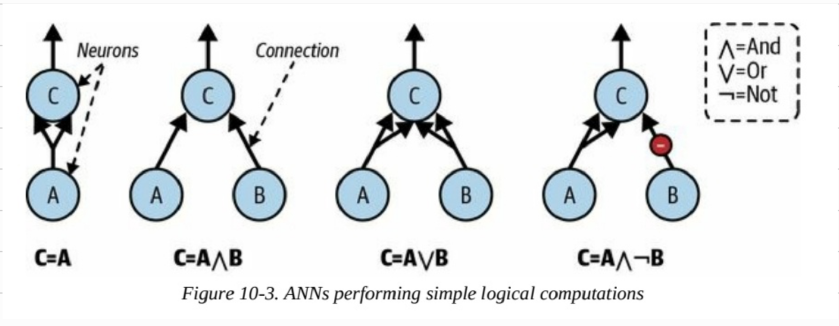

## Giới thiệu

McCulloch và Pts đề xuất một mô hình đơn giản của neuron sinh học, được biết đến sau này là neuron nhân tạo, có đầu vào nhị phân và đầu ra nhị phân. Một neuron nhân tạo kích hoạt đầu ra của mình khi có nhiều hơn một số lượng nhất định của các đầu vào của nó được kích hoạt. Họ chỉ ra rằng có thể xây dựng mạng lưới các neuron nhân tạo có khả năng tính toán bất kỳ đề xuất logic nào. Để hiểu mạng lưới này hoạt động như thế nào, hãy xem xét một vài mạng neuron nhân tạo (ANNs) thực hiện các tính toán logic đơn giản:



1. Mạng đầu tiên thực hiện chức năng đồng nhất: Nếu neuron A kích hoạt, neuron C cũng kích hoạt.
2. Mạng thứ hai thực hiện phép AND logic: Neuron C chỉ kích hoạt khi cả hai neuron A và B đều được kích hoạt.
3. Mạng thứ ba thực hiện phép OR logic: Neuron C kích hoạt nếu neuron A hoặc B kích hoạt.
4. Mạng thứ tư tính toán một đề xuất phức tạp hơn: Neuron C chỉ kích hoạt nếu neuron A kích hoạt và neuron B tắt.

Nếu giả sử một kết nối đầu vào có thể ức chế hoạt động của neuron (như trong neuron sinh học), mạng thứ tư có thể được coi như tực hiện phép NOT logic: Neugon C kích hoạt khi neuron B tắt, và ngược lại. Các mạng này có thể được kết hợp để tính toán các bểu thức logic phức tạp.

## **Perceptron**

**Khái niệm cơ bản:**
- **Phát minh:** Perceptron là một trong những kiến trúc mạng nơ-ron nhân tạo (ANN) đơn giản nhất, được Frank Rosenblatt phát minh vào năm 1957.
- **Cơ sở:** Dựa trên loại nơ-ron nhân tạo gọi là đơn vị logic ngưỡng (TLU) hoặc đơn vị ngưỡng tuyến tính (LTU).
- **Khái niệm:**
  
  - Một perceptron có một nơ-ron duy nhất có trọng số khớp thần kinh có thể điều chỉnh được và một bộ giới hạn cứng.
- **Đặc điểm TLU:**
  - **Đầu vào và đầu ra:** Số (không phải giá trị nhị phân bật/tắt)
  - **Trọng số:** Mỗi kết nối đầu vào có một trọng số.
  - **Quy trình xử lý:**
    - Tính toán hàm tuyến tính của đầu vào: `z = w1x1 + w2x2 + ... + wnxn + b = wx + b`.
    - Áp dụng hàm bước vào kết quả: `h(x) = step(z)`

**So sánh với Hồi quy Logistic:**
- Gần giống hồi quy logistic nhưng sử dụng hàm bước thay vì hàm logistic.
- Tham số mô hình bao gồm trọng số đầu vào `w` và thuật ngữ độ lệch `b`

**Hàm bước trong Perceptrons:**
- **Hàm bước Heaviside:**
  - `heaviside(z) = 0` nếu `z < 0`
  - `heaviside(z) = 1` nếu `z >= 0`
- **Hàm dấu (sgn):**
  - `sgn(z) = -1` nếu `z < 0`
  - `sgn(z) = 0` nếu `z = 0`
  - `sgn(z) = +1` nếu `z > 0`

**Perceptron cho hàm logical:**
- Một lớp perceptron có thể học phép toán AND/OR
  
- Nó không thể được đào tạo để thực hiện Exclusive-OR
  
- Nói chung, perceptron chỉ có thể phân loại tuyến tính.

**Ứng dụng TLU:**
- Phân loại nhị phân tuyến tính đơn giản.
- Ví dụ: Phân loa hoa iris dựa trên chiều dài và chiều rộng cánh hoa.
- Đào tạo TLU: Tìm giá trị phù hợp cho `w1,w2, ..., wn` và `b`.

**Cấu trúc Perceptron:**


- **Lớp TLU:** Một hoặc nhiều TLU được tổ chức trong một lớp đơn.
- **Kết nối:** Mỗi TLU kết nối với mọi đầu vào.
- **Lớp kết nối đầy đủ:** Gọi là lớp kết nối đầy đủ hoặc lớp dày đặc.
- **Lớp đầu vào:** Các đầu vào tạo thành lớp đầu vào.
- **Lớp đầu ra:** Lớp TLU tạo ra các đầu ra cuối cùng.

Ranh giới quyết định của mỗi nơ-ron đầu ra là tuyến tính, do đó perceptron không thể học được các mẫu phức tạp giống như các phân loại viên hồi quy logistic. Tuy nhiên, nếu các trường hợp huấn luyện có thể phân tách tuyến tính, Rosenblatt đã chứng minh rằng thuật toán này sẽ hội tụ đến một giải pháp. Điều này được gọi là định lý hội tụ perceptron. Scikit-Learn cung cấp một lớp Perceptron mà bạn có thể sử dụng như mong đợi, ví dụ trên bộ dữ liệu iris được giới thiệu trong Chương 4:

```Python
import numpy as np
from sklearn.datasets import load_iris
from sklearn.linear_model import Perceptron
iris = load_iris(as_frame=True)
X = iris.data[["petal length (cm)", "petal width (cm)"]].values
y = (iris.target == 0) # Iris setosa
per_clf = Perceptron(random_state=42)
per_clf.fit(X, y)
X_new = [[2, 0.5], [3, 1]]
y_pred = per_clf.predict(X_new) # dự đoán Đúng và Sai cho hai loại hoa này
```

Thuật toán học của perceptron giống với thuật toán hạ gradient ngẫu nhiên. Lớp Perceptron của Scikit-Learn tương đương với việc sử dụng SGDClassifier với các siêu tham số: loss="perceptron", learning_rate="constant", eta0=1 (tốc độ học), và penalty=None (không điều chuẩn).

Trong công trình của họ về Perceptrons năm 1969, Marvin Minsky và Seymour Papert đã chỉ ra một số điểm yếu nghiêm trọng của perceptrons - cụ thể là chúng không thể giải quyết một số vấn đề đơn giản, chẳng hạn như vấn đề phân loại XOR. Điều này cũng đúng với các mô hình phân loại tuyến tính khác như phân loại viên hồi quy logistic. Một số nhà nghiên cứu kỳ vọng nhiều hơn từ perceptrons và đã thất vọng đến mức từ bỏ hoàn toàn mạng nơ-ron để tập trung vào các vấn đề cấp cao hơn như logic, giải quyết vấn đề và tìm kiếm. Thiếu ứng dụng thực tế cũng không hỗ trợ sự phát triển của chúng.

Hóa ra, một số hạn chế của perceptrons có thể được khắc phục bằng cách xếp chồng nhiều perceptrons, tạo thành một mạng ANN được gọi là perceptron đa lớp (MLP). MLP có thể giải quyết vấn đề XOR, điều này có thể được kiểm chứng bằng cách tính toán đầu ra của MLP được mô tả bên phải hình ảnh: với đầu vào (0, 0) hoặc (1, 1), mạng sẽ cho đầu ra là 0, và với đầu vào (0, 1) hoặc (1, 0), mạng sẽ cho đầu ra là 1. Điều này chứng tỏ mạng có thể giải quyết vấn đề XOR. Thằng này có kết quả vậy là do nó làm toán cộng, khác với công thức cô cho


**Quiz Following Book:** Bài này làm theo sách, nên chúng ta sẽ + threshold


**Cấu Trúc và Tính Toán:***
- **Đề:** X1, X2 -> A,B = 1
- **Bias A = -3.2 , Bias B = 0.5**
- **A -**
- Kết quả giống bài dưới

**Quiz 01 - Perceptron:** Cách này làm theo cách của cô, cô cho công thức là phép trừ.


**Cấu Trúc và Tính Toán:**

- **Đề:** X1, X2 -> A, B = 1
- **Bias A = 1.5, Bias B = 0.5**
- **A -> C = -1, B -> C = 1**
- **Bias C = 0.5**

**Tình Huống 1: Khi X1 = 0, X2 = 0**
- A = (1 * 0) + (1 * 0) - 1.5 = -1.5 < 0 => A = 0
- B = (1 * 0) + (1 * 0) - 0.5 = -0.5 < 0 => B = 0
- C = (-1 * 0) + (1 * 0) - 0.5 = -0.5 < 0 => C = 0

**Tình Huống 2: Khi X1 = 0, X2 = 1**
- A = (1 * 0) + (1 * 1) - 1.5 = -0.5 < 0 => A = 0
- B = (1 * 0) + (1 * 1) - 0.5 = 0.5 >= 0 => B = 1
- C = (-1 * 0) + (1 * 1) - 0.5 = 0.5 >= 0 => C = 1

**Tình Huống 3: Khi X1 = 1, X2 = 0**
- A = (1 * 1) + (1 * 0) - 1.5 = -0.5 < 0 => A = 0
- B = (1 * 1) + (1 * 0) - 0.5 = 0.5 >= 0 => B = 1
- C = (-1 * 0) + (1 * 1) - 0.5 = -0.5 < 0 => C = 1

**Tình Huống 4: Khi X1 = 1, X2 = 1**
- A = (1 * 1) + (1 * 1) - 1.5 = 0.5 >= 0 => A = 1
- B = (1 * 1) + (1 * 1) - 0.5 = 1.5 >= 0 => B = 1
- C = (-1 * 1) + (1 * 1) - 0.5 = -0.5 < 0 => C = 0

## **Multilayer Perceptron**

### MLP (Mạng Perceptron Đa Lớp)


- **Cấu trúc:**
  - **Lớp Đầu vào:** Nơi nhận dữ liệu đầu vào.
  - **Lớp Ẩn:** Một hoặc nhiều lớp, chứa các TLU (đơn vị tuyến tính ngưỡng).
  - **Lớp Đầu ra:** Lớp TLU cuối cùng, đưa ra dự đoán cuối cùng.
  - **Lớp Dưới:** Gần lớp đầu vào.
  - **Lớp Trên:** Gần lớp đầu ra.


### DNN (Mạng Nơ-ron Sâu)
- **Định nghĩa:** ANN (Mạng Nơ-ron Nhân Tạo) với nhiều lớp ẩn.
- **Lĩnh Vực Học Sâu:** Nghiên cứu DNN và mô hình với chồng xử lý sâu.
- **Ghi chú:** Thuật ngữ "học sâu" thường được sử dụng khi nói về mạng nơ-ron, kể cả những mạng ít lớp.


### Lịch Sử và Phát Triển
- **Vấn Đề Cũ:** Gặp khó khăn trong việc huấn luyện MLP.
- **Năm 1960:** Đề xuất sử dụng gradient descent, nhưng khó khăn trong việc tính toán gradient cho mô hình phức tạp.
- **Năm 1970 - Seppo Linnainmaa:**
  - Đề xuất kỹ thuật tính toán gradient tự động và hiệu quả.
  - Phương pháp này giờ được gọi là reverse-mode autodiff.


### Backpropagation
- **Kết hợp:** Reverse-mode autodiff và gradient descent.
- **Quy Trình:**
  1. Tính toán gradient tự động cho mọi tham số mô hình.
  2. Sử dụng gradient này cho bước gradient descent.
  3. Lặp lại quá trình, giảm dần lỗi mạng nơ-ron đến điểm cực tiểu.
- **Kết quả:** Phương pháp huấn luyện hiệu quả cho mạng nơ-ron.

### Backpropagation

#### Tổng Quan
- **Ứng Dụng:** Không chỉ cho mạng nơ-ron, mà còn cho nhiều loại đồ thị tính toán khác.
- **Lịch Sử:**
  - **1970:** Được đề xuất bởi Seppo Linnainmaa, không chỉ dành riêng cho mạng nơ-ron.
  - **1985:** David Rumelhart, Geoffrey Hinton và Ronald Williams phổ biến phương pháp này thông qua một bài báo nghiên cứu về ảnh hưởng của backpropagation đối với việc học của mạng nơ-ron.
- **Hiện Nay:** Là kỹ thuật huấn luyện phổ biến nhất cho mạng nơ-ron.

#### Quy Trình Hoạt Động

1. **Xử Lý Mini-Batch:**
- Mỗi lô (32 ví dụ, ví dụ) xử lý một lần.
- Đi qua toàn bộ tập huấn luyện nhiều lần, mỗi lần gọi là một kỳ (epoch).

2. **Quá Trình Truyền Tiến:**
- Dữ liệu từng mini-batch được nhập qua lớp đầu vào.
- Tính toán đầu ra cho mỗi lớp từ lớp ẩn đầu tiên đến lớp đầu ra.
- Lưu giữ kết quả trung gian cho quá trình truyền ngược.

3. **Đo Lường Lỗi:**
- Sử dụng hàm mất mát để so sánh đầu ra mong muốn và thực tế, xác định lỗi.

4. **Quá Trình Truyền Ngược:**
- Tính toán ảnh hưởng của mỗi bias và trọng số đến lỗi (sử dụng quy tắc chuỗi).
- Truyền ngược lỗi qua mạng, từ lớp đầu ra đến lớp đầu vào.
- Xác định gradient lỗi cho mỗi trọng số và bias.

5. **Bước Hạ Gradient:**
- Điều chỉnh trọng số kết nối dựa trên gradient lỗi tính toán được.

#### Kết Luận

- **Mục Tiêu:** Giảm dần lỗi mạng nơ-ron để đạt tới điểm cực tiểu.
- **Tầm Quan Trọng:** Là nền tảng cho việc huấn luyện mạng nơ-ron sâu hiện đại.

1. **Quá Trình Truyền Tiến:**
- Dự đoán cho một mini-batch.

2. **Đo Lường Lỗi:**
- Xác định lỗi dựa trên kết quả dự đoán.

3. **Quá Trình Truyền Ngược:**
- Đo lường đóng góp lỗi từ mỗi tham số qua từng lớp.

4. **Điều Chỉnh Tham Số:**
- Tinh chỉnh trọng số kết nối và bias (bước hạ gradient).

### Thay Đổi Kiến Trúc MLP
- **Từ Hàm Bước Sang Hàm Logistic (Sigmoid):**
  - **Hàm Sigmoid:** σ(z) = 1 / (1 + exp(–z))

### Các Hàm Kích Hoạt Khác
1. **Hàm Hyperbolic Tangent (tanh):**
- **Công Thức:** tanh(z) = 2σ(2z) – 1
- Đầu ra từ –1 đến 1, giúp tập trung đầu ra xung quanh 0.

2. **Hàm Đơn Vị Tuyến Tính Chỉnh Lưu (ReLU):**
- **Công Thức:** ReLU(z) = max(0, z)
- Phổ biến nhưng không khả vi tại z = 0.


### Tại Sao Cần Hàm Kích Hoạt?
- **Tránh Kết Quả Tuyến Tính khi Kết Hợp Các Lớp:**
  - Chỉ kết hợp các biến đổi tuyến tính sẽ không giải quyết được vấn đề phức tạp.

### Ứng Dụng của Mạng Nơ-ron
- **Kiến Thức Nền Tảng:**
  - Nguồn gốc, kiến trúc, cách tính toán đầu ra của mạng nơ-ron.
  - Hiểu về thuật toán backpropagation.
- **Câu Hỏi Đặt Ra:**
  - Mạng nơ-ron có thể được sử dụng trong những trường hợp nào?
