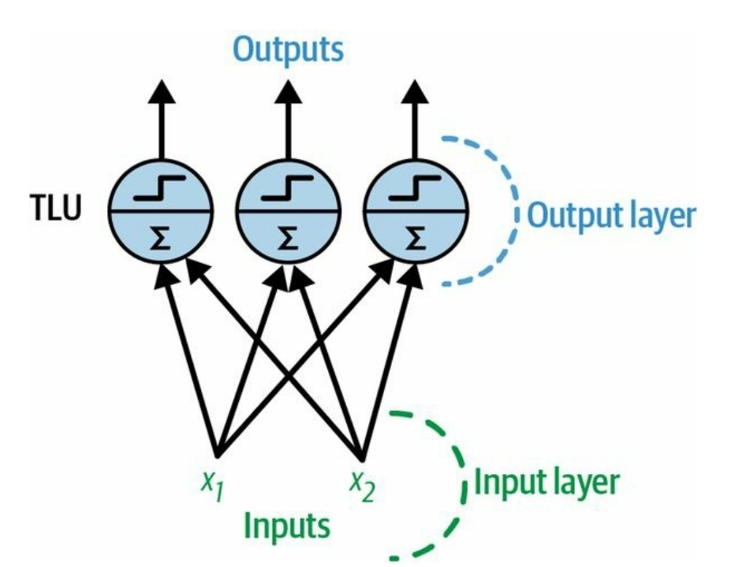

## Giới thiệu 

McCulloch và Pts đề xuất một mô hình đơn giản của neuron sinh học, được biết đến sau này là neuron nhân tạo, có đầu vào nhị phân và đầu ra nhị phân. Một neuron nhân tạo kích hoạt đầu ra của mình khi có nhiều hơn một số lượng nhất định của các đầu vào của nó được kích hoạt. Họ chỉ ra rằng có thể xây dựng mạng lưới các neuron nhân tạo có khả năng tính toán bất kỳ đề xuất logic nào. Để hiểu mạng lưới này hoạt động như thế nào, hãy xem xét một vài mạng neuron nhân tạo (ANNs) thực hiện các tính toán logic đơn giản:

1. Mạng đầu tiên thực hiện chức năng đồng nhất: Nếu neuron A kích hoạt, neuron C cũng kích hoạt.
2. Mạng thứ hai thực hiện phép AND logic: Neuron C chỉ kích hoạt khi cả hai neuron A và B đều được kích hoạt.
3. Mạng thứ ba thực hiện phép OR logic: Neuron C kích hoạt nếu neuron A hoặc B kích hoạt.
4. Mạng thứ tư tính toán một đề xuất phức tạp hơn: Neuron C chỉ kích hoạt nếu neuron A kích hoạt và neuron B tắt.

Nếu giả sử một kết nối đầu vào có thể ức chế hoạt động của neuron (như trong neuron sinh học), mạng thứ tư có thể được coi như tực hiện phép NOT logic: Neugon C kích hoạt khi neuron B tắt, và ngược lại. Các mạng này có thể được kết hợp để tính toán các bểu thức logic phức tạp.

## **Perceptron**

**Khái niệm cơ bản:**
- **Phát minh:** Perceptron là một trong những kiến trúc mạng nơ-ron nhân tạo (ANN) đơn giản nhất, được Frank Rosenblatt phát minh vào năm 1957.
- **Cơ sở:** Dựa trên loại nơ-ron nhân tạo gọi là đơn vị logic ngưỡng (TLU) hoặc đơn vị ngưỡng tuyến tính (LTU).
- **Khái niệm:**
  
  - Một perceptron có một nơ-ron duy nhất có trọng số khớp thần kinh có thể điều chỉnh được và một bộ giới hạn cứng.
- **Đặc điểm TLU:**
  - **Đầu vào và đầu ra:** Số (không phải giá trị nhị phân bật/tắt)
  - **Trọng số:** Mỗi kết nối đầu vào có một trọng số.
  - **Quy trình xử lý:**
    - Tính toán hàm tuyến tính của đầu vào: `z = w1x1 + w2x2 + ... + wnxn + b = wx + b`.
    - Áp dụng hàm bước vào kết quả: `h(x) = step(z)`
    
**So sánh với Hồi quy Logistic:**
- Gần giống hồi quy logistic nhưng sử dụng hàm bước thay vì hàm logistic.
- Tham số mô hình bao gồm trọng số đầu vào `w` và thuật ngữ độ lệch `b`

**Hàm bước trong Perceptrons:**
- **Hàm bước Heaviside:**
  - `heaviside(z) = 0` nếu `z < 0`
  - `heaviside(z) = 1` nếu `z >= 0`
- **Hàm dấu (sgn):**
  - `sgn(z) = -1` nếu `z < 0`
  - `sgn(z) = 0` nếu `z = 0`
  - `sgn(z) = +1` nếu `z > 0`

**Perceptron cho hàm logical:**
- Một lớp perceptron có thể học phép toán AND/OR

- Nó không thể được đào tạo để thực hiện Exclusive-OR

- Nói chung, perceptron chỉ có thể phân loại tuyến tính.

**Ứng dụng TLU:**
  - Phân loại nhị phân tuyến tính đơn giản.
  - Ví dụ: Phân loa hoa iris dựa trên chiều dài và chiều rộng cánh hoa.
  - Đào tạo TLU: Tìm giá trị phù hợp cho `w1,w2, ..., wn` và `b`.

**Cấu trúc Perceptron:**

  - **Lớp TLU:** Một hoặc nhiều TLU được tổ chức trong một lớp đơn.
  - **Kết nối:** Mỗi TLU kết nối với mọi đầu vào.
  - **Lớp kết nối đầy đủ:** Gọi là lớp kết nối đầy đủ hoặc lớp dày đặc.
  - **Lớp đầu vào:** Các đầu vào tạo thành lớp đầu vào.
  - **Lớp đầu ra:** Lớp TLU tạo ra các đầu ra cuối cùng.

**Quiz 01 - Perceptron:**

**Cấu Trúc và Tính Toán:**

- **Đề:** X1, X2 -> A, B = 1
- **Bias A = 1.5, Bias B = 0.5**
- **A -> C = -1, B -> C = 1**
- **Bias C = 0.5**

**Tình Huống 1: Khi X1 = 0, X2 = 0**
- A = (1 * 0) + (1 * 0) - 1.5 = -1.5 < 0 => A = 0
- B = (1 * 0) + (1 * 0) - 0.5 = -0.5 < 0 => B = 0
- C = (-1 * 0) + (1 * 0) - 0.5 = -0.5 < 0 => C = 0

**Tình Huống 2: Khi X1 = 0, X2 = 1**
- A = (1 * 0) + (1 * 1) - 1.5 = -0.5 < 0 => A = 0
- B = (1 * 0) + (1 * 1) - 0.5 = 0.5 >= 0 => B = 1
- C = (-1 * 0) + (1 * 1) - 0.5 = 0.5 >= 0 => C = 1

**Tình Huống 3: Khi X1 = 1, X2 = 0**
- A = (1 * 1) + (1 * 0) - 1.5 = -0.5 < 0 => A = 0
- B = (1 * 1) + (1 * 0) - 0.5 = 0.5 >= 0 => B = 1
- C = (-1 * 1) + (1 * 0) - 0.5 = -0.5 < 0 => C = 0

**Tình Huống 4: Khi X1 = 1, X2 = 1**
- A = (1 * 1) + (1 * 1) - 1.5 = 0.5 >= 0 => A = 1
- B = (1 * 1) + (1 * 1) - 0.5 = 1.5 >= 0 => B = 1
- C = (-1 * 1) + (1 * 1) - 0.5 = -0.5 < 0 => C = 0
